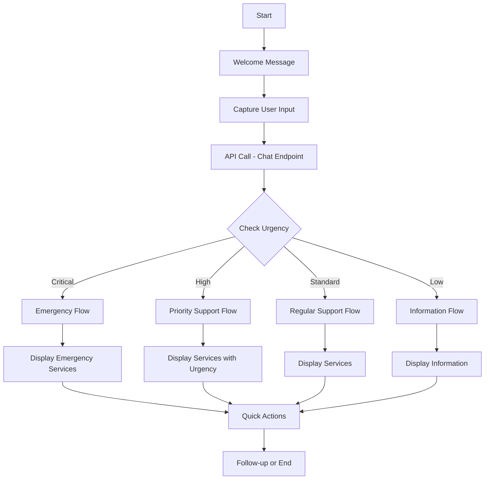

# 🎯 Complete Voiceflow Integration Guide for ACT Refugee Support API

## Table of Contents
1. [Prerequisites](#prerequisites)
2. [Initial Voiceflow Setup](#initial-voiceflow-setup)
3. [API Integration Configuration](#api-integration-configuration)
4. [Building Conversation Flows](#building-conversation-flows)
5. [Custom Code Blocks](#custom-code-blocks)
6. [Response Handling](#response-handling)
7. [Testing & Debugging](#testing--debugging)
8. [Advanced Features](#advanced-features)
9. [Troubleshooting](#troubleshooting)

---

## 📋 Prerequisites

Before starting, ensure you have:
- ✅ Voiceflow account (Pro or Team plan for API access)
- ✅ Deployed API endpoint (Railway or local)
- ✅ API documentation and test endpoints ready
- ✅ Basic understanding of Voiceflow's interface

## 🚀 Initial Voiceflow Setup

### Step 1: Create New Assistant Project

1. **Log into Voiceflow** → Click "New Assistant"
2. **Choose Template**: Select "Blank Project" or "Customer Support"
3. **Name Your Project**: "ACT Refugee Support Assistant"
4. **Select Channel**: Choose "Chat" or "Voice" (or both)

### Step 2: Configure Project Settings

Navigate to **Project Settings** (gear icon):

```yaml
General Settings:
  Name: ACT Refugee Support Assistant
  Description: Intelligent support for refugees and migrants in ACT
  Default Language: English
  
NLU Settings:
  Model: Enhanced NLU
  Confidence Threshold: 0.7
  
Chat Settings:
  Response Delay: 500ms
  Typing Indicator: Enabled
```

### Step 3: Set Up Variables

Go to **Variables** section and create:

```javascript
// User Variables
{user_id}         // String - Unique user identifier
{user_language}   // String - User's preferred language
{user_location}   // String - User location (default: "Canberra")
{user_context}    // Object - Conversation context

// Session Variables
{intent}          // String - Detected intent
{urgency}         // String - Urgency level
{services}        // Array - Retrieved services
{quick_replies}   // Array - Suggested responses
{call_scripts}    // Array - Phone call scripts
{next_steps}      // Array - Recommended actions

// API Variables
{api_response}    // Object - Full API response
{api_status}      // Boolean - API call success
{error_message}   // String - Error details
```

---

## 🔌 API Integration Configuration

### Step 1: Add API Integration

1. Go to **Integrations** → **Custom API**
2. Click **"Add Custom Integration"**
3. Configure as follows:

```yaml
Integration Name: ACT Refugee Support API
Base URL: https://your-api.railway.app
Authentication: None (or Bearer Token if implemented)
Headers:
  Content-Type: application/json
  Accept: application/json
```

### Step 2: Create API Endpoints

Add these endpoint configurations:

#### Main Chat Endpoint
```yaml
Name: Chat Endpoint
Method: POST
Path: /api/v2/chat
Headers: 
  Content-Type: application/json
Body Type: JSON
Body Template: |
  {
    "message": "{last_utterance}",
    "user_id": "{user_id}",
    "language": "{user_language}",
    "location": "{user_location}",
    "context": {
      "conversation_history": "{conversation_history}",
      "previous_intent": "{intent}"
    }
  }
Response Mapping:
  {api_response} = response
  {services} = response.services
  {quick_replies} = response.quick_replies
  {intent} = response.metadata.intent
  {urgency} = response.metadata.urgency
```

#### Emergency Endpoint
```yaml
Name: Emergency Services
Method: POST
Path: /api/v2/emergency
Headers:
  Content-Type: application/json
Body Type: JSON
Body Template: |
  {
    "trigger": "emergency_button"
  }
Response Mapping:
  {services} = response.services
  {next_steps} = response.next_steps
```

---

## 🏗️ Building Conversation Flows

### Main Conversation Flow Structure



### Step 1: Welcome Flow

Create a **Start Block** with welcome message:

```javascript
// Welcome Block - Speak/Text
Welcome to ACT Refugee Support Services. 

I'm here to help you find the right support services in Canberra.

You can ask me about:
• Housing and accommodation
• Employment and job search
• Emergency assistance
• Legal help
• Healthcare services
• Education and training

How can I help you today?

// Set initial variables
Set {user_language} = "English"
Set {user_location} = "Canberra"
Set {user_id} = random()
```

### Step 2: Input Capture Block

Add **Capture Block** with these intents:

```yaml
Intents Configuration:
  - Emergency Help
    Utterances:
      - "I need emergency help"
      - "This is urgent"
      - "Help me now"
      - "Call 000"
    
  - Housing Support
    Utterances:
      - "I need accommodation"
      - "I'm homeless"
      - "Need a place to stay"
      
  - Job Search
    Utterances:
      - "I need a job"
      - "Looking for work"
      - "Employment help"
      
  - Digital Assistance
    Utterances:
      - "Help with MyGov"
      - "Computer help"
      - "Online services"
```

### Step 3: API Integration Block

Add **Custom Code Block** for API call:

```javascript
// API Call Function
async function callRefugeeAPI() {
  const API_URL = 'https://your-api.railway.app/api/v2/chat';
  
  // Prepare request body
  const requestBody = {
    message: {last_utterance},
    user_id: {user_id} || 'vf_' + Date.now(),
    language: {user_language} || 'English',
    location: {user_location} || 'Canberra',
    context: {
      previous_intent: {intent} || null,
      conversation_turn: {turn_count} || 1
    }
  };
  
  try {
    // Make API call
    const response = await fetch(API_URL, {
      method: 'POST',
      headers: {
        'Content-Type': 'application/json'
      },
      body: JSON.stringify(requestBody)
    });
    
    if (!response.ok) {
      throw new Error(`API Error: ${response.status}`);
    }
    
    const data = await response.json();
    
    // Store response data in variables
    {api_response} = data;
    {api_status} = data.success;
    {services} = data.services || [];
    {quick_replies} = data.quick_replies || [];
    {intent} = data.metadata?.intent || 'general';
    {urgency} = data.metadata?.urgency || 'standard';
    {call_scripts} = data.call_scripts || [];
    {next_steps} = data.next_steps || [];
    
    // Return success
    return true;
    
  } catch (error) {
    console.error('API Error:', error);
    {error_message} = error.message;
    {api_status} = false;
    
    // Set fallback data
    {services} = [
      {
        name: "Emergency Services",
        phone: "000",
        description: "For immediate help"
      },
      {
        name: "Translating and Interpreting Service",
        phone: "131 450",
        description: "24/7 language support"
      }
    ];
    
    return false;
  }
}

// Execute the API call
await callRefugeeAPI();
```

---

## 📱 Response Handling

### Step 1: Urgency-Based Routing

Add **Condition Block** after API call:

```javascript
// Check urgency level and route accordingly
if ({urgency} === 'critical') {
  // Route to Emergency Flow
  next_path = 'emergency_flow';
} else if ({urgency} === 'high') {
  // Route to Priority Flow
  next_path = 'priority_flow';
} else if ({urgency} === 'standard') {
  // Route to Standard Flow
  next_path = 'standard_flow';
} else {
  // Route to Information Flow
  next_path = 'info_flow';
}
```

### Step 2: Display Services - Card Carousel

Create **Card Block** for each flow:

#### Emergency Services Display
```javascript
// Emergency Card Template
Title: "⚠️ EMERGENCY HELP AVAILABLE"
Description: "Immediate assistance is available. Call 000 for emergencies."

// Loop through emergency services
{services}.forEach(service => {
  Card:
    Title: {service.name}
    Description: {service.description}
    Image: emergency_icon.png
    Buttons:
      - Label: "Call {service.phone}"
        Action: External Link
        URL: "tel:{service.phone}"
      - Label: "More Info"
        Action: Text
        Value: "Tell me more about {service.name}"
});

// Add immediate actions text
Text: "IMMEDIATE ACTIONS:"
{next_steps}.forEach(step => {
  Text: "• {step}"
});
```

#### Standard Services Display
```javascript
// Service Cards for standard flow
if ({services}.length > 0) {
  Text: "{api_response.message}"
  
  // Create carousel of service cards
  Carousel:
    {services}.slice(0, 5).map(service => ({
      Title: service.name,
      Subtitle: service.location || 'Canberra',
      Description: service.description.substring(0, 150) + '...',
      Image: getServiceIcon(service),
      Buttons: [
        {
          Label: `Call ${service.phone}`,
          Type: 'phone',
          Value: service.phone
        },
        {
          Label: 'Save Contact',
          Type: 'text',
          Value: `save_contact_${service.name}`
        }
      ]
    }))
} else {
  Text: "I couldn't find specific services, but here are some general resources that might help."
}
```

### Step 3: Quick Replies Implementation

Add **Choice Block** with dynamic options:

```javascript
// Dynamic Quick Replies
if ({quick_replies} && {quick_replies}.length > 0) {
  // Create buttons from quick replies
  Buttons:
    {quick_replies}.map(reply => ({
      Label: reply,
      Value: reply
    }))
} else {
  // Default options
  Buttons:
    - "Find more services"
    - "Emergency help"
    - "Change language"
    - "Start over"
}
```

### Step 4: Call Scripts Display

For services requiring phone calls:

```javascript
// Display Call Scripts
if ({call_scripts} && {call_scripts}.length > 0) {
  Text: "📞 When calling, you can say:"
  
  {call_scripts}.forEach((script, index) => {
    Text: `${index + 1}. "${script}"`
  });
  
  Text: "Would you like me to help you practice these phrases?"
  
  Buttons:
    - "Practice phrases"
    - "Save scripts"
    - "Continue"
}
```

---

## 🔧 Custom Code Blocks

### Language Detection and Setting

```javascript
// Language Detection Block
const supportedLanguages = [
  'English', 'Arabic', 'Mandarin', 'Spanish', 
  'French', 'Dari', 'Farsi', 'Vietnamese'
];

// Check if user mentioned a language
const userInput = {last_utterance}.toLowerCase();
let detectedLanguage = 'English';

supportedLanguages.forEach(lang => {
  if (userInput.includes(lang.toLowerCase())) {
    detectedLanguage = lang;
  }
});

// Update if different from current
if (detectedLanguage !== {user_language}) {
  {user_language} = detectedLanguage;
  
  // Notify user
  Text: `I've switched to ${detectedLanguage}. I'll provide information considering your language preference.`
}
```

### Service Filtering by Category

```javascript
// Filter Services by Category
function filterServices(services, category) {
  const categoryKeywords = {
    housing: ['housing', 'accommodation', 'shelter', 'rent'],
    employment: ['job', 'work', 'employment', 'career'],
    health: ['health', 'medical', 'doctor', 'mental'],
    legal: ['legal', 'visa', 'immigration', 'lawyer'],
    education: ['school', 'education', 'training', 'course']
  };
  
  const keywords = categoryKeywords[category] || [];
  
  return services.filter(service => {
    const text = (service.name + ' ' + service.description).toLowerCase();
    return keywords.some(keyword => text.includes(keyword));
  });
}

// Apply filter if category is specified
if ({selected_category}) {
  {filtered_services} = filterServices({services}, {selected_category});
} else {
  {filtered_services} = {services};
}
```

### Error Handling and Fallback

```javascript
// Error Handler Block
if (!{api_status}) {
  Text: "I'm having trouble accessing the full service database right now, but I can still help you."
  
  Text: "Here are emergency contacts that are always available:"
  
  Card:
    Title: "Emergency Services"
    Description: "Police, Fire, Ambulance"
    Button: 
      Label: "Call 000"
      Action: "tel:000"
  
  Card:
    Title: "Interpreter Service"
    Description: "24/7 translation support"
    Button:
      Label: "Call 131 450"
      Action: "tel:131450"
  
  Text: "Would you like me to try again or would you prefer to continue with limited services?"
  
  Buttons:
    - "Try again"
    - "Continue with limited services"
    - "End conversation"
}
```

### Context Preservation

```javascript
// Save Context Block
// Store conversation context for next turn
{conversation_context} = {
  last_intent: {intent},
  last_services: {services}.map(s => s.name),
  last_urgency: {urgency},
  turn_count: ({turn_count} || 0) + 1,
  timestamp: new Date().toISOString(),
  language: {user_language},
  location: {user_location}
};

// Store in persistent memory if available
if (memory) {
  memory.set('user_context_' + {user_id}, {conversation_context});
}
```

#### Voiceflow Webhook (Alternative)
```yaml
Name: Webhook Integration
Method: POST
Path: /voiceflow/webhook
Headers:
  Content-Type: application/json
Body Type: JSON
Body Template: |
  {
    "query": "{last_utterance}",
    "user": {
      "id": "{user_id}",
      "name": "{user_name}"
    },
    "language": "{user_language}",
    "context": {
      "session_id": "{session_id}",
      "turn_count": "{turn_count}"
    }
  }
```

---

## 🧪 Testing & Debugging

### Step 1: Test Mode Configuration

Enable test mode in Voiceflow:

```javascript
// Test Configuration Block
const IS_TEST_MODE = true; // Set to false in production

if (IS_TEST_MODE) {
  // Use local API for testing
  API_BASE_URL = 'http://localhost:8002';
  
  // Add debug logging
  console.log('Request:', {
    message: {last_utterance},
    user_id: {user_id},
    language: {user_language}
  });
  
  console.log('Response:', {api_response});
  
  // Show debug info in chat
  Text: `[DEBUG] Intent: {intent}, Urgency: {urgency}, Services: {services.length}`
} else {
  // Production API
  API_BASE_URL = 'https://your-api.railway.app';
}
```

### Step 2: Test Scenarios

Create test flows for each scenario:

```yaml
Test Scenarios:
  1. Emergency Response:
     Input: "I need urgent help!"
     Expected: Emergency services, critical urgency
     
  2. Housing Search:
     Input: "I need accommodation"
     Expected: Housing services, standard/high urgency
     
  3. Multilingual:
     Input: "I speak Arabic"
     Expected: Language change, Arabic call scripts
     
  4. Complex Query:
     Input: "I just arrived with my family and need help"
     Expected: Multiple services, hidden needs detection
     
  5. API Failure:
     Simulate: API timeout
     Expected: Fallback services, error message
```

### Step 3: Debug Console Setup

Add debug output blocks:

```javascript
// Debug Console Block
function debugLog(label, data) {
  if (IS_TEST_MODE) {
    console.group(label);
    console.log('Timestamp:', new Date().toISOString());
    console.log('Data:', JSON.stringify(data, null, 2));
    console.groupEnd();
  }
}

// Log API calls
debugLog('API Request', {
  endpoint: '/api/v2/chat',
  body: requestBody,
  headers: headers
});

// Log responses
debugLog('API Response', {
  status: {api_status},
  services_count: {services}.length,
  intent: {intent},
  urgency: {urgency}
});

// Log errors
if ({error_message}) {
  debugLog('Error', {
    message: {error_message},
    fallback_activated: true
  });
}
```

---

## 🚀 Advanced Features

### 1. Multi-Turn Conversations

Implement conversation memory:

```javascript
// Conversation Memory Management
const MAX_HISTORY_LENGTH = 10;

// Initialize or retrieve conversation history
let conversationHistory = memory.get('conversation_' + {user_id}) || [];

// Add current turn
conversationHistory.push({
  user: {last_utterance},
  assistant: {api_response}.message,
  intent: {intent},
  timestamp: Date.now()
});

// Trim to max length
if (conversationHistory.length > MAX_HISTORY_LENGTH) {
  conversationHistory = conversationHistory.slice(-MAX_HISTORY_LENGTH);
}

// Save back to memory
memory.set('conversation_' + {user_id}, conversationHistory);

// Use history for context
{conversation_context} = {
  history: conversationHistory,
  turn_count: conversationHistory.length
};
```

### 2. Proactive Suggestions

Implement hidden needs detection:

```javascript
// Proactive Suggestions Block
if ({api_response}.metadata?.hidden_needs?.length > 0) {
  Text: "Based on what you've told me, you might also need help with:"
  
  {api_response}.metadata.hidden_needs.forEach(need => {
    Button:
      Label: need.label
      Value: `Tell me about ${need.type}`
  });
  
  Text: "Would you like information about any of these services?"
}
```

### 3. Analytics Integration

Track user interactions:

```javascript
// Analytics Tracking Block
function trackEvent(eventName, properties) {
  // Send to analytics platform
  if (window.analytics) {
    analytics.track(eventName, {
      ...properties,
      user_id: {user_id},
      session_id: {session_id},
      timestamp: Date.now()
    });
  }
  
  // Log to Voiceflow analytics
  if (voiceflow.analytics) {
    voiceflow.analytics.track(eventName, properties);
  }
}

// Track key events
trackEvent('service_search', {
  intent: {intent},
  urgency: {urgency},
  services_found: {services}.length,
  language: {user_language}
});

// Track conversions
if ({urgency} === 'critical') {
  trackEvent('emergency_assistance_provided', {
    services: {services}.map(s => s.name)
  });
}
```

### 4. Multilingual Voice Support

For voice assistants:

```javascript
// Voice Language Configuration
const voiceConfig = {
  'English': { voice: 'en-US-Standard-A', speed: 1.0 },
  'Spanish': { voice: 'es-US-Standard-A', speed: 0.95 },
  'Arabic': { voice: 'ar-XA-Standard-A', speed: 0.9 },
  'Mandarin': { voice: 'cmn-CN-Standard-A', speed: 0.9 }
};

// Set voice based on language
const config = voiceConfig[{user_language}] || voiceConfig['English'];

// Apply voice settings
voice.setVoice(config.voice);
voice.setSpeed(config.speed);

// Add language-specific pronunciation hints
if ({user_language} !== 'English') {
  voice.addPronunciationHint('Centrelink', 'sen-ter-link');
  voice.addPronunciationHint('MyGov', 'my-gov');
}
```

### 5. Appointment Booking Integration

Add scheduling capability:

```javascript
// Appointment Booking Block
if ({intent} === 'appointment' || {last_utterance}.includes('book')) {
  Text: "I can help you schedule an appointment. Which service would you like to book with?"
  
  // Show available services for booking
  {services}.filter(s => s.booking_available).forEach(service => {
    Card:
      Title: service.name
      Description: `Next available: ${service.next_slot}`
      Button:
        Label: "Book Appointment"
        Action: "booking_flow"
        Value: service.id
  });
}

// Booking Flow
function bookAppointment(serviceId, preferredTime) {
  const bookingRequest = {
    service_id: serviceId,
    user_id: {user_id},
    preferred_time: preferredTime,
    language: {user_language},
    phone: {user_phone}
  };
  
  // Call booking API
  return fetch(API_BASE_URL + '/book', {
    method: 'POST',
    body: JSON.stringify(bookingRequest)
  });
}
```

---

## 🔍 Voiceflow Best Practices

### 1. Flow Organization

```yaml
Project Structure:
  Main Flow:
    - Welcome
    - Input Capture
    - API Integration
    - Response Handling
    
  Sub-Flows:
    - Emergency Flow
    - Service Search Flow
    - Language Selection Flow
    - Error Handling Flow
    
  Components (Reusable):
    - API Call Component
    - Service Display Component
    - Quick Reply Component
    - Error Handler Component
```

### 2. Variable Naming Convention

```javascript
// Use consistent naming
{user_*}      // User-specific data
{api_*}       // API-related data
{temp_*}      // Temporary variables
{config_*}    // Configuration settings
{debug_*}     // Debug information
```

### 3. Performance Optimization

```javascript
// Cache frequently used data
const CACHE_DURATION = 300000; // 5 minutes

function getCachedServices(category) {
  const cacheKey = `services_${category}_${user_language}`;
  const cached = memory.get(cacheKey);
  
  if (cached && (Date.now() - cached.timestamp) < CACHE_DURATION) {
    return cached.data;
  }
  
  return null;
}

function setCachedServices(category, services) {
  const cacheKey = `services_${category}_${user_language}`;
  memory.set(cacheKey, {
    data: services,
    timestamp: Date.now()
  });
}
```

---

## 🐛 Troubleshooting

### Common Issues and Solutions

#### Issue 1: API Connection Fails
```javascript
// Solution: Implement retry logic
async function apiCallWithRetry(url, options, maxRetries = 3) {
  for (let i = 0; i < maxRetries; i++) {
    try {
      const response = await fetch(url, options);
      if (response.ok) return response;
      
      // Wait before retry
      await new Promise(resolve => setTimeout(resolve, 1000 * (i + 1)));
    } catch (error) {
      if (i === maxRetries - 1) throw error;
    }
  }
}
```

#### Issue 2: Cards Not Displaying
```javascript
// Solution: Validate card data
function validateCard(card) {
  return {
    title: card.title || 'Service',
    description: (card.description || '').substring(0, 200),
    image: card.image || 'default_image.png',
    buttons: (card.buttons || []).slice(0, 3) // Max 3 buttons
  };
}
```

#### Issue 3: Variables Not Persisting
```javascript
// Solution: Use proper variable scope
// Global variables: Use {variable_name}
// Local variables: Use variable_name (no braces)
// Memory storage: Use memory.set/get
```

#### Issue 4: Timeout on API Calls
```javascript
// Solution: Implement timeout handling
const timeoutPromise = new Promise((_, reject) => 
  setTimeout(() => reject(new Error('API Timeout')), 5000)
);

try {
  const response = await Promise.race([
    fetch(API_URL, options),
    timeoutPromise
  ]);
} catch (error) {
  // Handle timeout
  Text: "The service is taking longer than expected. Please try again."
}
```

---

## 📚 Additional Resources

### Voiceflow Documentation
- [Official Docs](https://docs.voiceflow.com)
- [API Reference](https://docs.voiceflow.com/api)
- [Community Forum](https://forum.voiceflow.com)

### Integration Templates
- [GitHub Repository](https://github.com/voiceflow/templates)
- [Code Examples](https://github.com/voiceflow/examples)

### Support Channels
- Voiceflow Discord: [Join Server](https://discord.gg/voiceflow)
- Technical Support: support@voiceflow.com
- API Issues: Report in project dashboard

---

## 🎯 Quick Start Checklist

- [ ] Create Voiceflow project
- [ ] Set up variables
- [ ] Configure API integration
- [ ] Build main conversation flow
- [ ] Add emergency handling
- [ ] Implement service display cards
- [ ] Add quick replies
- [ ] Test with sample queries
- [ ] Configure error handling
- [ ] Deploy and monitor

---

## 📋 Step-by-Step Implementation Guide

### Day 1: Setup and Basic Flow
1. Create Voiceflow project
2. Configure project settings
3. Set up variables
4. Build welcome flow
5. Add input capture

### Day 2: API Integration
1. Configure API endpoints
2. Create custom code blocks
3. Test API connectivity
4. Handle API responses
5. Implement error handling

### Day 3: Response Formatting
1. Create service cards
2. Add quick replies
3. Implement call scripts
4. Build urgency routing
5. Test different scenarios

### Day 4: Advanced Features
1. Add language detection
2. Implement context preservation
3. Create proactive suggestions
4. Add analytics tracking
5. Test multi-turn conversations

### Day 5: Polish and Deploy
1. Complete error handling
2. Add fallback responses
3. Test all flows
4. Deploy to production
5. Monitor and optimize

---

**Last Updated**: December 2024  
**Guide Version**: 1.0.0  
**API Compatibility**: v2.0.0  
**Contact**: support@actrefugee.org
